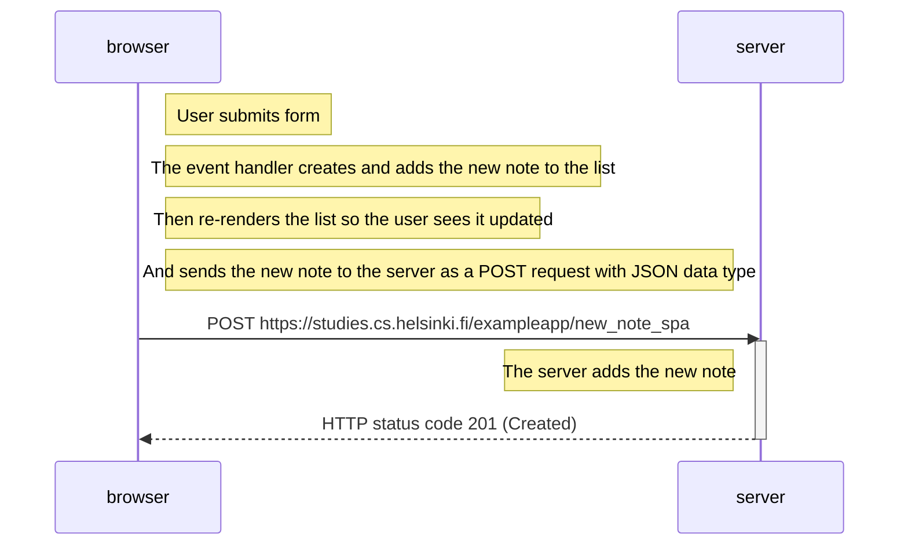

# New note in single page app diagram

```mermaid
sequenceDiagram
    participant browser
    participant server

    Note right of browser: User submits form

    Note right of browser: The event handler creates and adds the new note to the list

    Note right of browser: Then re-renders the list so the user sees it updated

    Note right of browser: And sends the new note to the server as a POST request with JSON data type

    browser->>server: POST https://studies.cs.helsinki.fi/exampleapp/new_note_spa
    activate server

    Note left of server: The server adds the new note

    server-->>browser: HTTP status code 201 (Created)
    deactivate server
```
